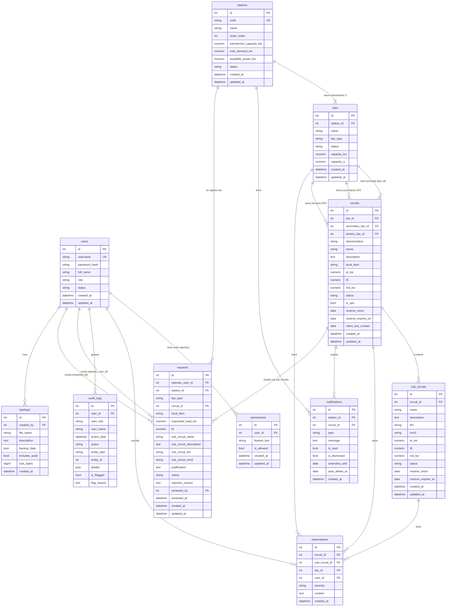

# Esquema de Base de Datos — Sistema de Gestión Energética · Línea 1 Metro

> **Motor:** PostgreSQL 15
> **ORM:** SQLAlchemy 2.x (modelos en `backend/app/models/`)
> **Versión del sistema:** 1.1.8

---

## Tabla de contenidos

1. [Resumen del modelo](#1-resumen-del-modelo)
2. [Diagrama ERD](#2-diagrama-erd)
3. [Tablas](#3-tablas)
   - [users](#31-users)
   - [permissions](#32-permissions)
   - [stations](#33-stations)
   - [bars](#34-bars)
   - [circuits](#35-circuits)
   - [sub_circuits](#36-sub_circuits)
   - [requests](#37-requests)
   - [observations](#38-observations)
   - [notifications](#39-notifications)
   - [audit_logs](#310-audit_logs)
   - [backups](#311-backups)
4. [Enumeraciones y valores permitidos](#4-enumeraciones-y-valores-permitidos)
5. [Reglas de cascada](#5-reglas-de-cascada)
6. [Reglas de negocio: BD vs aplicación](#6-reglas-de-negocio-bd-vs-aplicación)

---

## 1. Resumen del modelo

El sistema gestiona la infraestructura eléctrica de **26 estaciones** de la Línea 1 del Metro de Lima. El modelo de datos refleja la jerarquía física de la instalación eléctrica:

```
Station (estación)
  └─ Bar (barra eléctrica) × 3 por estación
       └─ Circuit (circuito eléctrico)
            └─ SubCircuit (sub-circuito / derivación)
```

Junto a esta jerarquía principal conviven entidades transversales:

| Entidad | Rol |
|---------|-----|
| `users` + `permissions` | Control de acceso con dos roles y permisos granulares |
| `requests` | Flujo de solicitudes de ampliación de carga (Opersac → Admin) |
| `observations` | Notas técnicas inmutables sobre cualquier nivel de la jerarquía |
| `notifications` | Alertas automáticas del sistema (sobrecarga, reserva vencida) |
| `audit_logs` | Trazabilidad completa de todas las acciones del sistema |
| `backups` | Snapshots JSON de la base de datos para restauración |

---

## 2. Diagrama ERD



---

## 3. Tablas

### 3.1 `users`

Usuarios del sistema. Dos roles con comportamientos distintos: `admin` (acceso total) y `opersac` (acceso según `permissions`).

| Columna | Tipo SQL | Nulable | Default | Notas |
|---------|----------|---------|---------|-------|
| `id` | `INTEGER` | NO | autoincrement PK | |
| `username` | `VARCHAR(50)` | NO | — | UNIQUE |
| `password_hash` | `VARCHAR(255)` | NO | — | Hash bcrypt; nunca texto plano |
| `full_name` | `VARCHAR(100)` | NO | — | |
| `role` | `VARCHAR(20)` | NO | — | `'admin'` \| `'opersac'` |
| `status` | `VARCHAR(20)` | NO | `'active'` | `'active'` \| `'inactive'` |
| `created_at` | `TIMESTAMPTZ` | NO | `now()` | |
| `updated_at` | `TIMESTAMPTZ` | NO | `now()` | Se actualiza automáticamente |

**Relaciones salientes:**
- `users.id` ← `permissions.user_id` (cascade delete)
- `users.id` ← `audit_logs.user_id`
- `users.id` ← `requests.opersac_user_id`
- `users.id` ← `requests.reviewed_by`
- `users.id` ← `backups.created_by`
- `users.id` ← `observations.user_id`

---

### 3.2 `permissions`

Permisos granulares para usuarios `opersac`. Los admins no tienen filas en esta tabla; el código los trata como si tuvieran todos los permisos habilitados.

| Columna | Tipo SQL | Nulable | Default | Notas |
|---------|----------|---------|---------|-------|
| `id` | `INTEGER` | NO | autoincrement PK | |
| `user_id` | `INTEGER` | NO | — | FK → `users.id` |
| `feature_key` | `VARCHAR(50)` | NO | — | Ver enumeración §4 |
| `is_allowed` | `BOOLEAN` | NO | `true` | `false` = permiso denegado explícito |
| `created_at` | `TIMESTAMPTZ` | NO | `now()` | |
| `updated_at` | `TIMESTAMPTZ` | NO | `now()` | |

**Constraint:** `UNIQUE(user_id, feature_key)` — un usuario no puede tener dos filas para la misma funcionalidad.

---

### 3.3 `stations`

Las 26 estaciones físicas de la Línea 1 (E01 Villa El Salvador → E26 Bayóvar). Los campos de energía (`max_demand_kw`, `available_power_kw`, `status`) son calculados y se actualizan por `EnergyCalculator` tras cada cambio en circuitos.

| Columna | Tipo SQL | Nulable | Default | Notas |
|---------|----------|---------|---------|-------|
| `id` | `INTEGER` | NO | autoincrement PK | |
| `code` | `VARCHAR(10)` | NO | — | UNIQUE. Ej: `'E01'`, `'E26'` |
| `name` | `VARCHAR(100)` | NO | — | Nombre oficial de la estación |
| `order_index` | `INTEGER` | NO | — | 1–26; posición en la línea |
| `transformer_capacity_kw` | `NUMERIC(10,2)` | NO | `0` | Capacidad total del transformador (kW) |
| `max_demand_kw` | `NUMERIC(10,2)` | NO | `0` | **Calculado:** suma de MD de circuitos operativos |
| `available_power_kw` | `NUMERIC(10,2)` | NO | `0` | **Calculado:** `transformer_capacity_kw - max_demand_kw` |
| `status` | `VARCHAR(20)` | NO | `'green'` | **Calculado:** ver enumeración §4 |
| `created_at` | `TIMESTAMPTZ` | NO | `now()` | |
| `updated_at` | `TIMESTAMPTZ` | NO | `now()` | |

> **Nota:** `max_demand_kw`, `available_power_kw` y `status` **no deben modificarse directamente**. Son mantenidos por `EnergyCalculator.recalculate_station()`.

---

### 3.4 `bars`

Barras eléctricas. Cada estación tiene exactamente 3: `normal`, `emergencia` y `continuidad`. Los campos `capacity_kw` y `capacity_a` se configuran por el admin con los valores reales del cuadro eléctrico.

| Columna | Tipo SQL | Nulable | Default | Notas |
|---------|----------|---------|---------|-------|
| `id` | `INTEGER` | NO | autoincrement PK | |
| `station_id` | `INTEGER` | NO | — | FK → `stations.id` ON DELETE CASCADE |
| `name` | `VARCHAR(50)` | NO | — | Nombre descriptivo de la barra |
| `bar_type` | `VARCHAR(20)` | NO | — | `'normal'` \| `'emergencia'` \| `'continuidad'` |
| `status` | `VARCHAR(20)` | NO | `'operative'` | Estado operativo de la barra |
| `capacity_kw` | `NUMERIC(10,2)` | NO | `0` | Capacidad máxima en kW |
| `capacity_a` | `NUMERIC(10,2)` | NO | `0` | Capacidad máxima en amperios |
| `created_at` | `TIMESTAMPTZ` | NO | `now()` | |
| `updated_at` | `TIMESTAMPTZ` | NO | `now()` | |

---

### 3.5 `circuits`

Circuitos eléctricos conectados a una barra. La relación con `bars` es triple: `bar_id` (primaria, obligatoria) + `secondary_bar_id` y `tertiary_bar_id` (opcionales, solo para circuitos UPS).

| Columna | Tipo SQL | Nulable | Default | Notas |
|---------|----------|---------|---------|-------|
| `id` | `INTEGER` | NO | autoincrement PK | |
| `bar_id` | `INTEGER` | NO | — | FK → `bars.id` ON DELETE CASCADE. INDEX |
| `secondary_bar_id` | `INTEGER` | SÍ | NULL | FK → `bars.id`. Solo si `is_ups = true` |
| `tertiary_bar_id` | `INTEGER` | SÍ | NULL | FK → `bars.id`. Solo si `is_ups = true` |
| `denomination` | `VARCHAR(100)` | NO | — | Código/denominación del circuito |
| `name` | `VARCHAR(100)` | NO | — | Nombre descriptivo |
| `description` | `TEXT` | SÍ | NULL | |
| `local_item` | `VARCHAR(100)` | SÍ | NULL | Referencia al ítem local / cliente |
| `pi_kw` | `NUMERIC(10,2)` | NO | `0` | Potencia instalada (kW) |
| `fd` | `NUMERIC(5,4)` | NO | `1.0` | Factor de demanda (0–1) |
| `md_kw` | `NUMERIC(10,2)` | NO | `0` | **Calculado:** `pi_kw × fd` |
| `status` | `VARCHAR(30)` | NO | `'operative_normal'` | Ver enumeración §4. INDEX |
| `is_ups` | `BOOLEAN` | NO | `false` | Si `true`, requiere `secondary_bar_id` y `tertiary_bar_id` |
| `reserve_since` | `DATE` | SÍ | NULL | Fecha de inicio de la reserva |
| `reserve_expires_at` | `DATE` | SÍ | NULL | Fecha límite de la reserva |
| `client_last_contact` | `DATE` | SÍ | NULL | Último contacto con el cliente titular |
| `created_at` | `TIMESTAMPTZ` | NO | `now()` | |
| `updated_at` | `TIMESTAMPTZ` | NO | `now()` | |

**Regla UPS:** Cuando `is_ups = true`, `secondary_bar_id` y `tertiary_bar_id` deben ser distintos entre sí y distintos de `bar_id`. Esta validación se aplica en la capa de aplicación (no hay constraint en BD).

---

### 3.6 `sub_circuits`

Sub-divisiones dentro de un circuito. Comparten la misma lógica de cálculo MD = PI × FD y los mismos estados de reserva que los circuitos.

| Columna | Tipo SQL | Nulable | Default | Notas |
|---------|----------|---------|---------|-------|
| `id` | `INTEGER` | NO | autoincrement PK | |
| `circuit_id` | `INTEGER` | NO | — | FK → `circuits.id` ON DELETE CASCADE. INDEX |
| `name` | `VARCHAR(100)` | NO | — | Denominación del sub-circuito |
| `description` | `TEXT` | SÍ | NULL | |
| `itm` | `VARCHAR(50)` | SÍ | NULL | Referencia del interruptor termomagnético |
| `mm2` | `VARCHAR(50)` | SÍ | NULL | Sección del conductor en mm² |
| `pi_kw` | `NUMERIC(10,2)` | NO | `0` | Potencia instalada (kW) |
| `fd` | `NUMERIC(5,4)` | NO | `1.0` | Factor de demanda (0–1) |
| `md_kw` | `NUMERIC(10,2)` | NO | `0` | **Calculado:** `pi_kw × fd` |
| `status` | `VARCHAR(30)` | NO | `'operative_normal'` | Ver enumeración §4. INDEX |
| `reserve_since` | `DATE` | SÍ | NULL | |
| `reserve_expires_at` | `DATE` | SÍ | NULL | |
| `created_at` | `TIMESTAMPTZ` | NO | `now()` | |
| `updated_at` | `TIMESTAMPTZ` | NO | `now()` | |

---

### 3.7 `requests`

Solicitudes de ampliación de carga enviadas por usuarios Opersac y revisadas por admins.

**Lógica de bifurcación según `circuit_id`:**
- `circuit_id IS NULL` → se solicita un **circuito nuevo** en la barra indicada por `bar_type`
- `circuit_id IS NOT NULL` → se solicita un **sub-circuito nuevo** dentro del circuito existente; los campos `sub_circuit_*` contienen sus datos

| Columna | Tipo SQL | Nulable | Default | Notas |
|---------|----------|---------|---------|-------|
| `id` | `INTEGER` | NO | autoincrement PK | |
| `opersac_user_id` | `INTEGER` | NO | — | FK → `users.id` |
| `station_id` | `INTEGER` | NO | — | FK → `stations.id` |
| `bar_type` | `VARCHAR(20)` | NO | — | `'normal'` \| `'emergencia'` \| `'continuidad'` |
| `circuit_id` | `INTEGER` | SÍ | NULL | FK → `circuits.id`. NULL = nuevo circuito |
| `local_item` | `VARCHAR(100)` | SÍ | NULL | |
| `requested_load_kw` | `NUMERIC(10,2)` | NO | — | Carga solicitada (kW) |
| `fd` | `NUMERIC(5,4)` | NO | `1.0` | Factor de demanda propuesto |
| `sub_circuit_name` | `VARCHAR(100)` | SÍ | NULL | Solo cuando `circuit_id IS NOT NULL` |
| `sub_circuit_description` | `TEXT` | SÍ | NULL | |
| `sub_circuit_itm` | `VARCHAR(50)` | SÍ | NULL | |
| `sub_circuit_mm2` | `VARCHAR(50)` | SÍ | NULL | |
| `justification` | `TEXT` | SÍ | NULL | Justificación del operador |
| `status` | `VARCHAR(20)` | NO | `'pending'` | Ver enumeración §4. INDEX |
| `rejection_reason` | `TEXT` | SÍ | NULL | Solo cuando `status = 'rejected'` |
| `reviewed_by` | `INTEGER` | SÍ | NULL | FK → `users.id` (admin que revisó) |
| `reviewed_at` | `TIMESTAMPTZ` | SÍ | NULL | |
| `created_at` | `TIMESTAMPTZ` | NO | `now()` | |
| `updated_at` | `TIMESTAMPTZ` | NO | `now()` | |

---

### 3.8 `observations`

Notas técnicas inmutables (no tienen `updated_at`). Cada observación se asocia a **exactamente una** de las tres entidades posibles: barra, circuito o sub-circuito; los otros dos FK permanecen en NULL.

| Columna | Tipo SQL | Nulable | Default | Notas |
|---------|----------|---------|---------|-------|
| `id` | `INTEGER` | NO | autoincrement PK | |
| `circuit_id` | `INTEGER` | SÍ | NULL | FK → `circuits.id` ON DELETE CASCADE |
| `sub_circuit_id` | `INTEGER` | SÍ | NULL | FK → `sub_circuits.id` ON DELETE CASCADE |
| `bar_id` | `INTEGER` | SÍ | NULL | FK → `bars.id` ON DELETE CASCADE |
| `user_id` | `INTEGER` | NO | — | FK → `users.id` |
| `severity` | `VARCHAR(20)` | NO | — | `'info'` \| `'warning'` \| `'critical'` |
| `content` | `TEXT` | NO | — | Texto de la observación |
| `created_at` | `TIMESTAMPTZ` | NO | `now()` | No hay `updated_at`; las observaciones son inmutables |

> **Invariante de exclusividad:** exactamente uno de `circuit_id`, `sub_circuit_id`, `bar_id` debe ser no nulo. Esta regla se aplica en la capa de aplicación.

---

### 3.9 `notifications`

Alertas automáticas generadas por el scheduler o por operaciones del sistema. No tienen `updated_at`.

| Columna | Tipo SQL | Nulable | Default | Notas |
|---------|----------|---------|---------|-------|
| `id` | `INTEGER` | NO | autoincrement PK | |
| `station_id` | `INTEGER` | SÍ | NULL | FK → `stations.id` |
| `circuit_id` | `INTEGER` | SÍ | NULL | FK → `circuits.id` |
| `type` | `VARCHAR(30)` | NO | — | `'negative_energy'` \| `'reserve_no_contact'` |
| `message` | `TEXT` | NO | — | Texto legible de la alerta |
| `is_read` | `BOOLEAN` | NO | `false` | INDEX |
| `is_dismissed` | `BOOLEAN` | NO | `false` | |
| `extended_until` | `DATE` | SÍ | NULL | Fecha hasta la que se extendió la reserva |
| `auto_delete_at` | `DATE` | SÍ | NULL | Fecha de eliminación automática |
| `created_at` | `TIMESTAMPTZ` | NO | `now()` | |

---

### 3.10 `audit_logs`

Traza completa de operaciones del sistema. `user_role` y `user_name` se almacenan **desnormalizados** para preservar el contexto histórico incluso si el usuario es modificado o eliminado.

| Columna | Tipo SQL | Nulable | Default | Notas |
|---------|----------|---------|---------|-------|
| `id` | `INTEGER` | NO | autoincrement PK | |
| `user_id` | `INTEGER` | NO | — | FK → `users.id`. INDEX |
| `user_role` | `VARCHAR(20)` | NO | — | **Desnormalizado** del momento de la acción |
| `user_name` | `VARCHAR(100)` | NO | — | **Desnormalizado** del momento de la acción |
| `action_date` | `TIMESTAMPTZ` | NO | `now()` | INDEX (para consultas por rango de fechas) |
| `action` | `VARCHAR(100)` | NO | — | Ej: `'CREATE_CIRCUIT'`, `'APPROVE_REQUEST'` |
| `entity_type` | `VARCHAR(50)` | NO | — | Ej: `'circuit'`, `'station'`, `'request'` |
| `entity_id` | `INTEGER` | SÍ | NULL | ID de la entidad afectada |
| `details` | `JSON` | SÍ | NULL | Contexto adicional (valores anteriores, nuevos, etc.) |
| `is_flagged` | `BOOLEAN` | NO | `false` | Marcado por admin para revisión especial |
| `flag_reason` | `TEXT` | SÍ | NULL | Motivo del marcado; solo cuando `is_flagged = true` |

---

### 3.11 `backups`

Snapshots completos de la base de datos en formato JSON. El campo `backup_data` contiene la serialización de todas las tablas operativas. No tienen `updated_at`.

| Columna | Tipo SQL | Nulable | Default | Notas |
|---------|----------|---------|---------|-------|
| `id` | `INTEGER` | NO | autoincrement PK | |
| `created_by` | `INTEGER` | NO | — | FK → `users.id` (admin que generó el backup) |
| `file_name` | `VARCHAR(255)` | NO | — | Ej: `'backup_20250311_120000.json'` |
| `description` | `TEXT` | SÍ | NULL | |
| `backup_data` | `JSON` | NO | — | Datos serializados de todas las tablas |
| `includes_audit` | `BOOLEAN` | NO | `true` | Si incluye `audit_logs` en el snapshot |
| `size_bytes` | `BIGINT` | SÍ | NULL | Tamaño del JSON en bytes |
| `created_at` | `TIMESTAMPTZ` | NO | `now()` | |

---

## 4. Enumeraciones y valores permitidos

Estos campos no usan tipos `ENUM` de PostgreSQL; los valores se validan en la capa de aplicación (schemas Pydantic).

### `users.role`
| Valor | Descripción |
|-------|-------------|
| `admin` | Acceso total al sistema sin verificación de permisos |
| `opersac` | Acceso limitado según registros en `permissions` |

### `users.status`
| Valor | Descripción |
|-------|-------------|
| `active` | Usuario activo, puede iniciar sesión |
| `inactive` | Usuario deshabilitado, no puede iniciar sesión |

### `permissions.feature_key`
| Valor | Funcionalidad habilitada |
|-------|--------------------------|
| `view_stations` | Ver estado energético de estaciones |
| `view_circuits` | Ver circuitos y sub-circuitos |
| `send_requests` | Enviar solicitudes de ampliación |
| `add_observations` | Agregar observaciones técnicas |
| `view_reports` | Acceder a reportes del sistema |

### `stations.status`
| Valor | Condición |
|-------|-----------|
| `green` | `available_power_kw > 20%` de la capacidad del transformador |
| `yellow` | `available_power_kw ≤ 20%` de la capacidad (alerta) |
| `red` | `available_power_kw < 0` (sobrecarga del transformador) |

### `bars.bar_type`
| Valor | Descripción |
|-------|-------------|
| `normal` | Barra de alimentación principal |
| `emergencia` | Barra para suministro durante fallos del sistema principal |
| `continuidad` | Barra para cargas críticas sin tolerancia a interrupciones |

### `circuits.status` y `sub_circuits.status`
| Valor | Contribuye a cálculo energético | Descripción |
|-------|----------------------------------|-------------|
| `operative_normal` | **Sí** | Activo y en operación regular |
| `reserve_r` | No | En reserva rotativa |
| `reserve_equipped_re` | No | En reserva equipada |
| `inactive` | No | Fuera de servicio |

### `requests.status`
| Valor | Descripción |
|-------|-------------|
| `pending` | En espera de revisión |
| `approved` | Aprobada; el circuito/sub-circuito fue creado |
| `rejected` | Rechazada; motivo en `rejection_reason` |

### `observations.severity`
| Valor | Descripción |
|-------|-------------|
| `info` | Nota informativa sin impacto operativo |
| `warning` | Situación que requiere monitoreo o atención próxima |
| `critical` | Problema grave que exige acción inmediata |

### `notifications.type`
| Valor | Origen |
|-------|--------|
| `negative_energy` | La potencia disponible de una estación se volvió negativa |
| `reserve_no_contact` | Un circuito en reserva superó el plazo sin contacto con el cliente |

---

## 5. Reglas de cascada

| Relación | `ON DELETE` | Efecto |
|----------|-------------|--------|
| `stations` → `bars` | CASCADE | Eliminar una estación elimina sus 3 barras |
| `bars` → `circuits` (via `bar_id`) | CASCADE | Eliminar una barra elimina sus circuitos |
| `circuits` → `sub_circuits` | CASCADE | Eliminar un circuito elimina sus sub-circuitos |
| `circuits` → `observations` | CASCADE | Las observaciones de un circuito se eliminan con él |
| `sub_circuits` → `observations` | CASCADE | Las observaciones de un sub-circuito se eliminan con él |
| `bars` → `observations` | CASCADE | Las observaciones de una barra se eliminan con ella |
| `bars` ← `circuits.secondary_bar_id` | RESTRICT (default) | No elimina circuitos al borrar barra secundaria |
| `bars` ← `circuits.tertiary_bar_id` | RESTRICT (default) | No elimina circuitos al borrar barra terciaria |
| `users` → `permissions` | CASCADE (ORM) | Eliminar un usuario elimina sus permisos |

---

## 6. Reglas de negocio: BD vs aplicación

Las siguientes reglas **no están implementadas como constraints de base de datos** (CHECK, TRIGGER, ENUM); se aplican exclusivamente en la capa de aplicación (FastAPI + Pydantic):

| Regla | Dónde se aplica |
|-------|-----------------|
| `circuits.status IN ('reserve_r', 'reserve_equipped_re')` requiere `reserve_expires_at` no nulo | `POST /circuits/bar/{bar_id}` |
| `is_ups = true` requiere `secondary_bar_id` ≠ NULL, `tertiary_bar_id` ≠ NULL, y los tres bar_id distintos entre sí | `POST /circuits/bar/{bar_id}` |
| `md_kw = pi_kw × fd` si no se provee `md_kw` explícitamente | Endpoint de creación/actualización de circuitos y sub-circuitos |
| `stations.status` se recalcula tras cada cambio en circuitos | `EnergyCalculator.recalculate_station()` |
| `observations`: exactamente uno de `circuit_id`, `sub_circuit_id`, `bar_id` no nulo | `POST /observations` |
| `permissions.feature_key` en valores conocidos | Schema Pydantic de permisos |
| `users.role` en `['admin', 'opersac']` | Schema Pydantic de usuarios |
| `fd` entre 0 y 1 | Validación en schemas y formularios del frontend |
| `pi_kw` y `md_kw` ≥ 0 | Validación en schemas y formularios del frontend |
